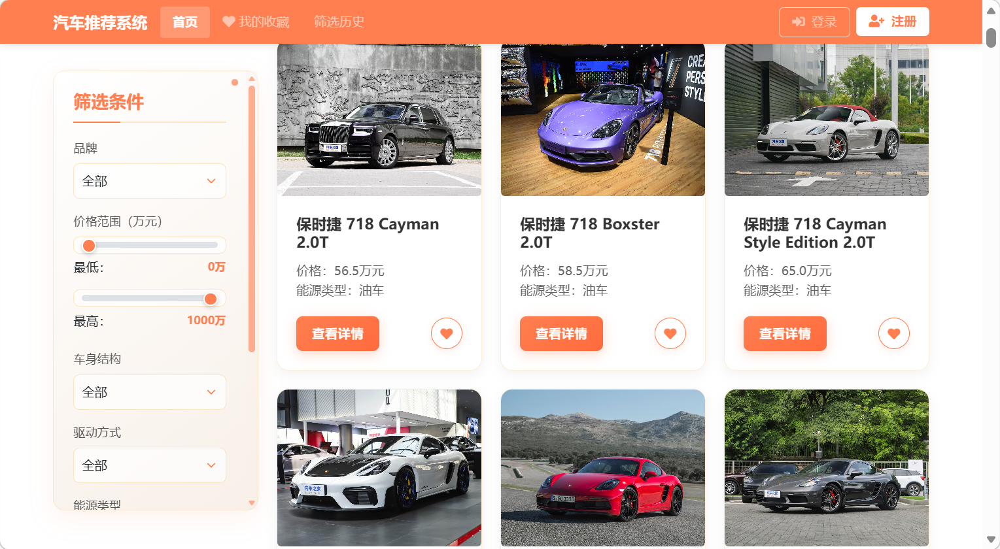
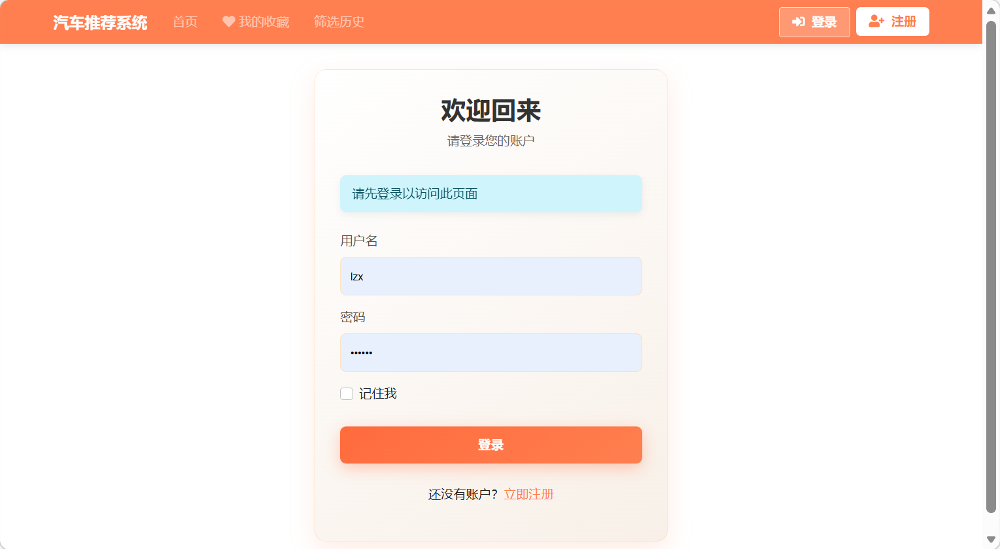
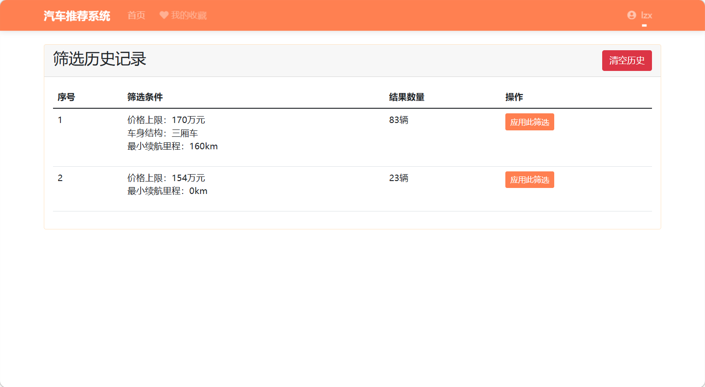

# 汽车推荐系统

一个基于Flask的汽车推荐系统，可以根据用户偏好筛选并推荐合适的车型。系统支持用户注册、登录、收藏车辆和查看筛选历史等功能。

## 项目架构

### 技术栈

- **后端**: Flask 2.0.1
- **数据库**: SQLite (Flask-SQLAlchemy 2.5.1)
- **用户认证**: Flask-Login 0.5.0
- **表单处理**: Flask-WTF 1.0.0
- **前端**: Bootstrap 5, jQuery, FontAwesome

### 目录结构

```
flaskcarsystem/
│
├── app.py                 # 应用程序入口点，包含所有路由和控制逻辑
├── models.py              # 数据模型定义，包括用户、车辆和收藏等
├── forms.py               # 表单类定义，用于用户注册和登录
├── requirements.txt       # 项目依赖列表
│
├── data/                  # 数据文件目录
│   ├── data.json          # 车辆数据
│   └── favorites.json     # 收藏数据（兼容旧版本）
│
├── static/                # 静态资源目录
│   ├── images/            # 车辆图片
│   └── welcomethanks/     # 欢迎页面资源
│
└── templates/             # HTML模板
    ├── base.html          # 基础模板，包含导航栏和页面结构
    ├── index.html         # 首页，显示车辆列表和筛选表单
    ├── details.html       # 车辆详情页
    ├── favorites.html     # 收藏页面
    ├── history.html       # 筛选历史页面
    ├── login.html         # 登录页面
    ├── register.html      # 注册页面
    └── profile.html       # 用户个人资料页面
```

### 核心模块

1. **用户认证系统**
   - 用户注册、登录和退出功能
   - 密码加密存储
   - 会话管理

2. **车辆推荐引擎**
   - 基于用户偏好的筛选算法
   - 支持多维度筛选条件（品牌、价格、车身类型等）

3. **收藏系统**
   - 用户可收藏感兴趣的车型
   - 收藏数据与用户账户关联

4. **筛选历史**
   - 记录用户的筛选条件和结果
   - 便于用户回顾之前的筛选

## 数据模型

### User 模型
用户数据模型，存储用户账户信息。

### Car 和 ElectricCar 模型
车辆数据模型，包含车辆的基本信息和特性。ElectricCar 继承自 Car，增加了续航里程等电动车特有属性。

### Favorite 模型
收藏数据模型，关联用户和车辆。

### UserPreferences 类
用户偏好类，用于存储筛选条件。

## 运行方式

### 环境要求

- Python 3.6 或更高版本
- pip 包管理器

### 安装步骤

1. **克隆或下载项目**

2. **安装依赖**
   ```bash
   cd flaskcarsystem
   pip install -r requirements.txt
   ```

3. **初始化数据库**
   数据库会在首次运行应用时自动创建。

4. **运行应用**
   ```bash
   python app.py
   ```

5. **访问应用**
   打开浏览器访问 http://127.0.0.1:5000/

## 📸 项目截图

| 首页浏览 | 筛选推荐 |
|:-------:|:-------:|
|  |  |

| 登录页面 | 筛选历史 |
|:-------:|:-------:|
|  |  |

### 使用指南

1. **注册/登录**
   - 点击右上角的"注册"按钮创建新账户
   - 使用已有账户登录系统

2. **浏览车辆**
   - 首页显示所有可用车辆
   - 使用左侧筛选表单设置筛选条件

3. **筛选条件**
   - 品牌：选择特定汽车品牌
   - 价格范围：设置最低和最高预算（0-1000万元）
   - 车身结构：选择车身类型
   - 驱动方式：选择驱动方式
   - 能源类型：选择燃油或电动车
   - 续航里程：设置电动车最小续航里程

4. **查看详情**
   - 点击车辆卡片上的"查看详情"按钮查看完整信息

5. **收藏车辆**
   - 点击车辆卡片上的心形图标收藏/取消收藏
   - 在"我的收藏"页面查看所有收藏的车辆

6. **查看筛选历史**
   - 在"筛选历史"页面查看之前的筛选条件和结果

7. **个人资料**
   - 登录后可查看个人资料页面
   - 显示收藏数量、筛选历史和最近活动

## 自定义与扩展

### 添加新车型

编辑 `data/data.json` 文件，按照现有格式添加新车型数据。

### 修改筛选条件

在 `index.html` 中修改筛选表单，并在 `app.py` 中更新相应的处理逻辑。

### 样式定制

修改 `base.html` 和各页面中的 CSS 样式以自定义界面外观。

## 技术特点

1. **响应式设计**：适配不同屏幕尺寸的设备
2. **动画效果**：导航栏、筛选框和卡片都有精美动画
3. **用户体验优化**：科技感滚动条、悬停效果和交互反馈
4. **安全性考虑**：密码加密存储、表单验证和CSRF保护

## 注意事项

- 默认数据库为 SQLite，存储在 `site.db` 文件中
- 静态图片需放置在 `static/images/` 目录下
- 车辆图片按照索引命名，格式为 `(索引号).jpg` 
>>>>>>> 2628ce4 (init: flask car recommendation system)
